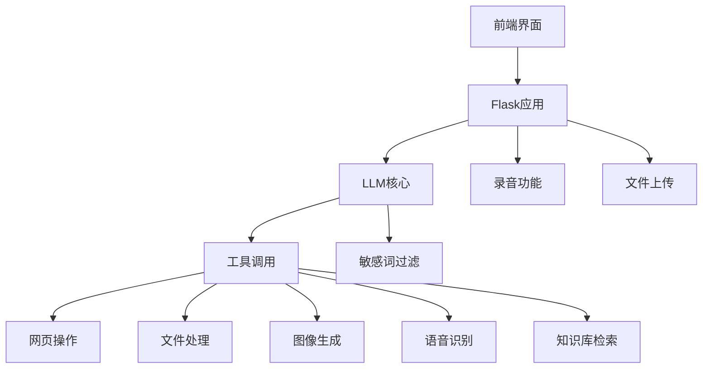

# AI 助手项目 README

## 项目概述

这是一个基于大语言模型的智能助手系统，能够处理用户输入（文本/语音/文件），调用各种工具完成任务，并通过 Web 界面与用户交互。项目整合了多种功能模块，包括网页操作、文件处理、图像生成、语音识别等，提供了强大的任务处理能力。

## 功能特性

- **多模态输入支持**：支持文本、语音和文件上传
- **工具调用系统**：可调用多种工具完成任务
- **知识库管理**：可上传文件构建知识库
- **流式响应**：实时显示 AI 处理结果
- **敏感词过滤**：内置敏感词过滤机制
- **跨平台支持**：可在多种环境中部署运行

## 项目结构

```
.
├── get_url.py          # 网页抓取与URL处理
├── prepare.py          # 环境准备与依赖安装
├── llm2.py             # 大语言模型交互核心
├── record.py           # 录音功能
├── main.py             # Flask 应用主入口
├── painter.py          # 图像生成模块
├── prompt.py           # 系统提示词
├── set.json            # 配置文件
├── tool.py             # 工具定义
├── index.html          # 前端界面
└── resources/          # 资源目录
    ├── uploads/        # 用户上传文件
    └── knowledge/      # 知识库文件
```

## 模块关系图



## 快速开始

### 安装依赖

```bash
python prepare.py
```

### 配置 API

编辑 `set.json` 文件配置您的 API 信息：

```json
{
    "talk-model": "your-model-name",
    "image-model": "your-image-model",
    "vision-model": "your-vision-model",
    "embedding-model": "your-embedding-model",
    "api_key": "your-api-key",
    "base_url": "your-api-base-url",
    "temprature": 0.9,
    "top_p": 0.9
}
```

### 运行应用

```bash
python main.py
```

访问 `http://127.0.0.1:5000` 使用 Web 界面

## 主要功能模块

### 1. 大语言模型交互 (llm2.py)

- 支持流式响应
- 支持工具调用
- 多轮对话管理

### 2. 工具系统 (tool.py)

系统支持多种工具调用：

| 工具名称          | 功能描述                     |
|-------------------|------------------------------|
| `exec_code`       | 执行 Python 代码             |
| `paint`           | 生成图像                     |
| `extract_text`    | 从文件中提取文本             |
| `watch`           | 分析图片内容                 |
| `semantic_search` | 知识库检索                   |
| `install`         | 安装 Python 库               |
| `recognize_speech`| 语音转文本                   |
| `get_url`         | 搜索相关问题网址             |
| `get_urltxt`      | 获取网页文本内容             |

### 3. 网页操作 (get_url.py)

- 使用 Selenium 获取完整网页内容
- 百度搜索结果提取
- 网页文本内容提取

### 4. 图像生成 (painter.py)

- 使用 DALL·E 模型生成图像
- 支持自定义提示词
- 自动保存生成结果

### 5. 录音功能 (record.py)

- 录制音频
- 保存为 WAV 格式
- 支持自定义录音时长

### 6. 知识库管理

- 文件上传与处理
- 知识检索功能
- 文件管理界面

## 使用示例

1. **文本交互**：
   - 在输入框中输入问题
   - AI 将自动调用相关工具处理

2. **文件处理**：
   - 上传文档/图片/音频文件
   - AI 自动分析文件内容并响应

3. **语音输入**：
   - 点击"开始录音"按钮录制语音
   - 系统自动将语音转为文本并处理

4. **知识库管理**：
   - 访问"构建知识库"页面
   - 上传文件构建个人知识库
   - 在对话中引用知识库内容

## 配置选项

在设置页面可配置以下选项：

- 对话模型
- 图像生成模型
- API 密钥
- 基础 URL
- 温度参数
- Top-p 参数

## 注意事项

1. 首次运行需执行 `prepare.py` 安装依赖
2. 确保已安装 Chrome 浏览器和对应版本的 chromedriver
3. 需要有效的 API 密钥才能使用大模型功能
4. 敏感词过滤功能默认启用，可在代码中调整

## 贡献指南

欢迎提交 Issue 和 Pull Request，贡献流程如下：

1. Fork 项目仓库
2. 创建特性分支 (`git checkout -b feature/your-feature`)
3. 提交更改 (`git commit -am 'Add some feature'`)
4. 推送到分支 (`git push origin feature/your-feature`)
5. 创建 Pull Request

## 许可证

本项目采用 MIT 许可证 - 详见 [LICENSE](LICENSE) 文件
