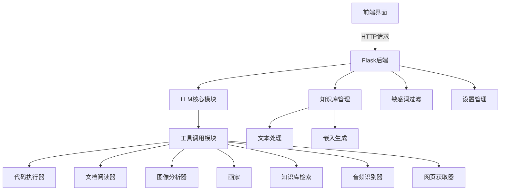

# AI 助手项目 - 多模态智能助手系统

## 项目概述

这是一个基于大语言模型的多功能智能助手系统，能够通过调用各种工具（代码执行、文档阅读、图像生成、知识库检索等）完成复杂的用户请求。系统采用模块化设计，前端使用HTML/CSS/JavaScript，后端使用Python Flask框架，支持流式响应和文件处理。

## 主要功能

1. **自然语言对话**：与AI助手进行自然语言交互
2. **多工具调用**：
   - 代码执行器（Python）
   - 文档阅读器（PDF/DOCX/TXT）
   - 图片分析器（图像内容识别）
   - 画家（文本生成图像）
   - 知识库检索（语义搜索）
   - 音频识别器（语音转文字）
   - 网页获取器（网页内容提取）
3. **知识库管理**：
   - 上传文档构建知识库
   - 语义检索相关知识
   - 文档处理与嵌入生成
4. **系统设置**：
   - 配置不同AI模型参数
   - 管理API密钥和基础URL
5. **敏感词过滤**：自动检测并过滤敏感内容

## 系统架构



## 安装与使用

### 环境准备

1. 安装Python 3.8+
2. 克隆项目仓库：
   ```bash
   git clone https://github.com/call123456789/agant.git
   cd agant
   ```
3. 安装依赖：
   ```bash
   python prepare.py
   ```

### 创建API

1. 在火山引擎官网创建API https://www.volcengine.com/
2. 开通文本、语音、视觉、向量模型

这两步的具体步骤见[《用户手册.docx》](用户手册.docx)

### 运行项目

```bash
python main.py
```

访问 `http://127.0.0.1:5000` 开始使用
点击设置，填入创建的API、服务器URL、各模型的名称等信息

## 主要模块说明

### 核心模块

1. **LLM (llm2.py)**：
   - 大语言模型交互核心
   - 支持流式响应
   - 工具调用分发

2. **工具调用 (tool.py)**：
   - 定义所有可用工具及其参数
   - 包括代码执行、图像生成、文档阅读等

### 功能模块

1. **知识库 (knowledge.py)**：
   - 文档处理与嵌入生成
   - 语义搜索实现
   - 文件存储与管理

2. **图像处理 (watcher.py)**：
   - 图像压缩与编码
   - 视觉模型调用
   - 图像内容分析

3. **语音处理 (speech.py)**：
   - 语音识别
   - 音频文件处理
   - 多语言支持

4. **网页处理 (get_url.py)**：
   - 网页内容抓取
   - 搜索结果提取
   - 网页文本解析

### 辅助模块

1. **敏感词过滤 (filter.py)**：
   - DFA算法实现
   - 支持最小/最大匹配模式
   - 可扩展敏感词库

2. **文档处理 (reader.py)**：
   - 支持PDF/DOCX/TXT格式
   - 文本内容提取
   - 格式保留处理

3. **设置管理 (main.py)**：
   - 模型参数配置
   - API密钥管理
   - 配置持久化

## 使用示例

### 1. 聊天界面
- 输入文本消息
- 上传文件（图片、文档等）
- 使用语音输入

### 2. 工具箱
- 启用/停用不同工具
- 构建知识库
- 管理已上传文件

### 3. 知识库管理
1. 访问 `/build-knowledge`
2. 上传文档（docx/pdf/txt）
3. 系统自动处理并添加到知识库
4. 使用语义搜索检索相关信息

### 4. 系统设置
1. 访问 `/setting`
2. 配置模型参数
3. 设置API密钥和基础URL
4. 调整温度和top_p参数

## 配置选项

配置文件 `set.json` 包含以下可配置项：

| 参数 | 类型 | 描述 | 默认值 |
|------|------|------|--------|
| talk-model | string | 对话模型名称 | - |
| image-model | string | 图像生成模型 | - |
| vision-model | string | 视觉分析模型 | - |
| embedding-model | string | 嵌入生成模型 | - |
| api_key | string | API访问密钥 | - |
| base_url | string | API基础URL | - |
| temprature | float | 生成多样性控制 | 0.9 |
| top_p | float | 核采样概率阈值 | 0.9 |

## 注意事项

1. 首次运行前需执行 `python prepare.py` 安装依赖
2. 确保配置正确的API密钥和模型名称
3. 知识库文件处理可能需要较长时间（大文件）
4. 语音识别功能需要麦克风权限
